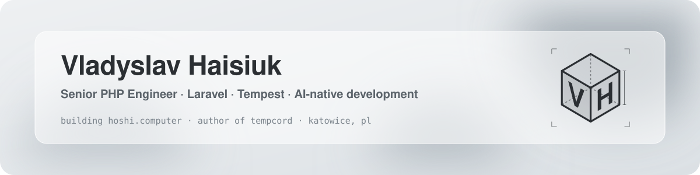
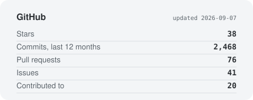
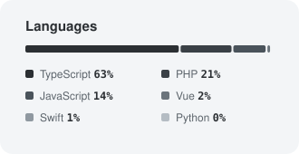
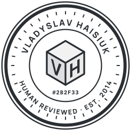

<picture>
  <source media="(prefers-color-scheme: dark)" srcset="assets/banner-dark.svg">
  
</picture>

  <picture>
    <source media="(prefers-color-scheme: dark)" srcset="https://readme-typing-svg.demolab.com/?font=JetBrains+Mono&size=16&duration=3500&pause=1200&color=A3ABB2&center=true&vCenter=true&width=720&height=36&lines=Building+Hoshi+%E2%80%94+a+private+cloud+computer+with+an+AI+agent+on+it;Author+of+Tempcord+%E2%80%94+a+Discord+framework+on+Tempest+(PHP+8.2%2B);Spec-driven+development%2C+agent-written+tests%2C+human+review;11%2B+years+of+PHP+%C2%B7+Laravel+%C2%B7+DDD+%C2%B7+CQRS+%C2%B7+AWS">
    
  </picture>

  <a href="https://hoshi.computer">hoshi.computer</a> &nbsp;·&nbsp;
  <a href="https://github.com/Tempcord">Tempcord</a> &nbsp;·&nbsp;
  <a href="https://cyberwolf.studio">CyberWolf.Studio</a> &nbsp;·&nbsp;
  <a href="https://www.linkedin.com/in/mikield/">LinkedIn</a> &nbsp;·&nbsp;
  <a href="mailto:vladyslav@cyberwolf.studio">Email</a>

 

Senior PHP engineer from Katowice, Poland. Eleven years of Laravel, REST APIs and microservices in e-commerce, FinTech and analytics — now mostly building agentic tooling and a Discord framework on [Tempest](https://tempestphp.com). Founder of [CyberWolf.Studio](https://cyberwolf.studio).

## Now

<table>
  <tr>
    <td width="50%" valign="top">
      <h3><a href="https://hoshi.computer">Hoshi.Computer</a></h3>
      
A private cloud computer for every person, with an AI agent living on it. Real terminal and browser, scheduled workflows, approval gates before anything consequential, and web / desktop / mobile / CLI / API clients.

      
Sole architect and developer · open alpha

    </td>
    <td width="50%" valign="top">
      <h3><a href="https://github.com/Tempcord">Tempcord</a></h3>
      
The modern way to build Discord bots in PHP 8.2+. Built on Tempest: type-safe, expressive, reads like English. Framework, HTTP and scheduled-tasks plugins, and typed Discord API mappings.

      
Pre-release · MIT · a ⭐ helps it get seen

    </td>
  </tr>
</table>

## How I work

I develop with AI agents daily and treat that as an engineering discipline, not autocomplete.

- **Specification first.** Every feature starts as a written spec; the agent works against it, not against a vague prompt.
- **Tests before code.** The agent writes tests to the spec, then the implementation. I review the tests as carefully as the code.
- **Human review, always.** Generated code is a draft. Merge decisions, architecture and tradeoffs are mine.
- **Isolated worktrees.** Parallel agent runs live in separate git worktrees, so experiments never touch the main line.
- **DDD when it earns its place.** Domain models make both me and the agent reason better — but it is a default, not a rule.

Tooling: Claude Code, OpenCode, GitHub Copilot, custom MCP servers and command presets. At work this turned into an autonomous bug-triage agent that reads Grafana/Loki, checks Jira, does root-cause analysis and files tickets — 50+ production bugs found and closed by it so far.

## Stack

`PHP 8.x` `Laravel` `Tempest` `Livewire` &nbsp;·&nbsp; `DDD` `CQRS` `Event Sourcing` `REST` &nbsp;·&nbsp; `MySQL` `PostgreSQL` `Redis` &nbsp;·&nbsp; `SQS` `RabbitMQ` `Kafka` &nbsp;·&nbsp; `AWS` `Docker` `Kubernetes` `GitLab CI` &nbsp;·&nbsp; `PHPUnit` `Pest` `TDD`

## Stats

  <picture>
    <source media="(prefers-color-scheme: dark)" srcset="assets/stats-dark.svg">
    
  </picture>
  <picture>
    <source media="(prefers-color-scheme: dark)" srcset="assets/langs-dark.svg">
    
  </picture>

<b>Earlier open source</b> — AdonisJS packages (2018–2020, maintenance mode)

 

- [adonis-ally-extended](https://github.com/mikield/adonis-ally-extended) — additional auth providers for Adonis Ally
- [adonis-user-policy](https://github.com/mikield/adonis-user-policy) — `can` / `canNot` policy trait for the User model
- [adonis-laravel-broadcaster](https://github.com/mikield/adonis-laravel-broadcaster) — broadcast AdonisJS events to Laravel Echo Server
- [adonis-true-traits](https://github.com/mikield/adonis-true-traits) — real traits for AdonisJS

 

  <picture>
    <source media="(prefers-color-scheme: dark)" srcset="assets/seal-round-dark.svg">
    
  </picture>

  
  &nbsp;
  
  &nbsp;
  

